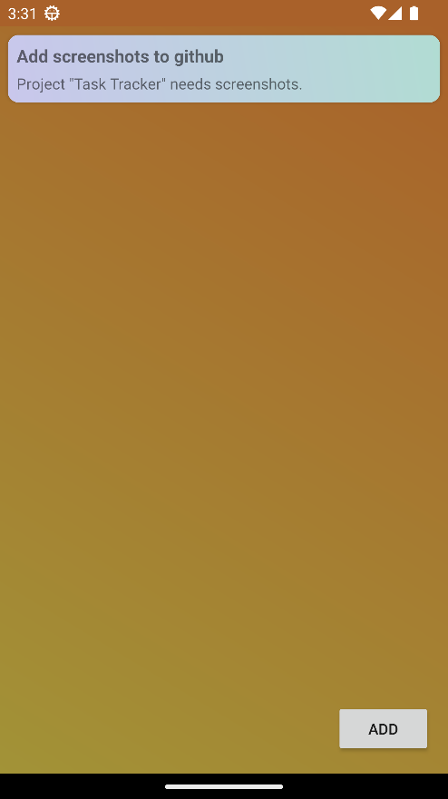

# TaskTracker
Task Tracker is a simple android application that aims to help the users keep a list of all the tasks they should complete while being as simple and non intrusive as possible.
The motivation to create this application is that most “TODO List” software for android includes a lot of functionalities and features that can get in the way of the user and end up being distracting.
Task tracker wants to be as close to a pen and paper TODO list as possible.

There is a Simple list of all of the tasks the user has added.

The user can add a task by tapping the “add” button. The user has to specify a name or title, the description is optional and can be left blank.

To delete a task the user simply swipes right. 

A dialog with the name of the task and a button with the text “undo” will appear at the bottom of the screen for a few seconds in case the user wants to undo the action.

